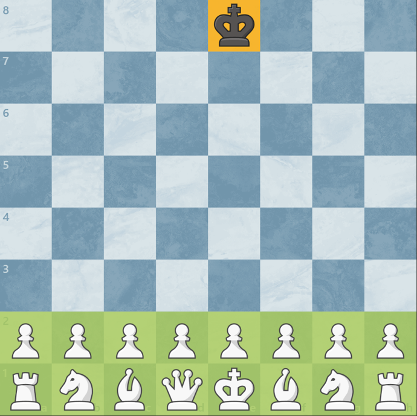

This was a musing that started as a response to a chess puzzle. What is the least number of moves required to result in this position:

[](https://www.youtube.com/post/Ugkx8bSSebtZEBAcEBt17CYl0Qx-RfGb8xUC)

As key insights:
- White can only move knights
- White needs to capture 15 black pieces
- White can't possibly capture any piece on the first move
- Knights alternate colors, so it requires an even number of moves to return to it's starting point

This put the lower bound at 16 moves. I spent about 15 minutes findings a few 18-move solutions before I finally discovered [this 16-move solution](https://lichess.org/ZbXPcTjm).

But then I wondered: how many 16-move solutions are there?

Short-answer: I found over 29 million solutions, but it was so computationally massive that the real answer is likely orders of magnitude higher.


### Implementation

This code implements basically searches possible moves following this idea:
1. The opening is hard-coded (because it's too computationally intensive to search every possible opening)
2. Consider every possible capture by that white knight
3. Consider every legal, non-capturing, black moves are considered.
4. Continue recursing in search of solutions

On my 12-core Ryzen 5, this searches about 30M-50M positions. When considering all legal, non-capturing black moves on black's turn, the exponential growth is quickly limits how many moves I can search. So the implementation explored a few filters to reduce the search space:

1. Never allowing the black king to move
2. Allowing the black king to move only during the last 2 moves (because some solutions require black to add a waiting move)
3. Never allowing black to move any piece backward
4. Never allowing black to move any piece backward more than 1 rank (useful to still allow black knights to reposion)

### Results

Some example runs:

- Hard-code 7 move opening, allowing all legal moves: searches 2.2B positions, finds 71.8k solutions with 9 unique knight paths
- Hard-code 6 move opening, filtering with (4): searches 13.8B positions, finds 286.5k solutions with 103 unique knight paths
- Hard-code 5 move opening, filtering with (3) and (4): searches 22.6B positions, finds 3.2M solutions with 47 unique knight paths
- Hard-code 4 move opening, filtering with (1) and (2): searches 6.7B positions, finds 148.2k solutions with 2 unique knight paths
- Hard-code 4 move opening, filtering with (3) and (4): searches 3.6T positions (>24 hours), finds 29.0M solutions with 98 unique knight paths

Opening used (openings were hard-coded through the white's move):

1. Nc3 b5
2. Nxb5 Nf6
3. Nxa7 Ne4
4. Nxc8 Nc3
5. Nxe7 g6
6. Nxg6 Nb1
7. Nxh8

This means I found 29M solutions that start with `1. Nc3 b5  2. Nxb5 Nf6  3. Nxa7 Ne4  4. Nxc8` that involved the white knight traveling along 98 unique paths, but it took over 24 hours to calculate. These are the 98 unique knight paths:

```
c3 b5 a7 c8 e7 c6 b8 d7 f8 g6 h4 f5 d4 b5 a3 b1
c3 b5 a7 c8 e7 f5 h4 g6 f8 h7 f8 d7 e5 c4 a3 b1
c3 b5 a7 c8 e7 f5 h4 g6 f8 d7 c5 d7 b6 c4 a3 b1
c3 b5 a7 c8 a7 c6 e5 d7 f8 h7 g5 f7 e5 c4 a3 b1
c3 b5 a7 c8 a7 c6 e5 f7 g5 h7 f8 d7 e5 c4 a3 b1
c3 b5 a7 c8 a7 c6 b8 d7 f8 h7 g5 f7 g5 e4 c3 b1
c3 b5 a7 c8 e7 c6 d8 f7 g5 h7 f8 d7 c5 e4 c3 b1
c3 b5 a7 c8 e7 g6 h4 f5 e7 c6 b8 d7 b6 c4 a3 b1
c3 b5 a7 c8 e7 c6 b8 d7 f8 h7 g5 f7 e5 c4 a3 b1
c3 b5 a7 c8 e7 g6 e5 d7 f8 h7 g5 f7 e5 c4 a3 b1
c3 b5 a7 c8 e7 c6 b8 d7 f8 h7 g5 f3 d4 b5 a3 b1
c3 b5 a7 c8 a7 c6 d8 f7 g5 h7 f8 d7 c5 e4 c3 b1
c3 b5 a7 c8 e7 f5 h4 g6 f8 d7 b8 c6 d4 b5 a3 b1
c3 b5 a7 c8 e7 c6 b8 d7 f8 h7 g5 e6 f4 d5 c3 b1
c3 b5 a7 c8 a7 c6 b8 d7 f8 h7 g5 e6 f4 d5 c3 b1
c3 b5 a7 c8 a7 c6 b8 d7 f8 g6 h4 f5 e7 d5 c3 b1
c3 b5 a7 c8 e7 c8 b6 d7 f8 h7 g5 f7 e5 c4 a3 b1
c3 b5 a7 c8 e7 c6 e5 f7 g5 h7 f8 d7 b6 d5 c3 b1
c3 b5 a7 c8 e7 g6 h8 f7 g5 h7 f8 d7 e5 c4 a3 b1
c3 b5 a7 c8 e7 g8 h6 f5 h4 g6 f8 d7 e5 c4 a3 b1
c3 b5 a7 c8 a7 c6 e5 f7 g5 h7 f8 d7 c5 e4 c3 b1
c3 b5 a7 c8 e7 g6 e5 f7 g5 h7 f8 d7 b6 c4 a3 b1
c3 b5 a7 c8 e7 c6 d8 f7 e5 d7 f8 h7 g5 e4 c3 b1
c3 b5 a7 c8 e7 g6 h8 f7 g5 h7 f8 d7 c5 e4 c3 b1
c3 b5 a7 c8 e7 c6 b8 d7 e5 f7 g5 h7 g5 e4 c3 b1
c3 b5 a7 c8 e7 g6 f8 h7 g5 f7 e5 d7 c5 e4 c3 b1
c3 b5 a7 c8 e7 f5 h4 g6 f8 d7 b8 d7 c5 a4 c3 b1
c3 b5 a7 c8 e7 g6 f8 h7 g5 f7 e5 c6 d4 b5 a3 b1
c3 b5 a7 c8 e7 g8 h6 f7 g5 e6 f8 d7 e5 c4 a3 b1
c3 b5 a7 c8 e7 g8 h6 f7 e5 d7 f8 g6 e5 c4 a3 b1
c3 b5 a7 c8 e7 g8 h6 f7 e5 g6 f8 d7 b6 c4 a3 b1
c3 b5 a7 c8 e7 g6 e5 f7 g5 h7 f8 d7 c5 e4 c3 b1
c3 b5 a7 c8 e7 f5 h6 f7 h8 g6 f8 d7 e5 c4 a3 b1
c3 b5 a7 c8 e7 f5 h6 f7 h8 g6 f8 d7 c5 e4 c3 b1
c3 b5 a7 c8 e7 d5 f4 g6 f8 h7 f8 d7 b6 c4 a3 b1
c3 b5 a7 c8 e7 g6 f8 h7 g5 f7 d8 c6 b4 d5 c3 b1
c3 b5 a7 c8 e7 c6 b8 d7 f8 h7 f8 g6 f4 d5 c3 b1
c3 b5 a7 c8 e7 g6 e7 g8 h6 f7 e5 d7 b6 c4 a3 b1
c3 b5 a7 c8 e7 f5 e7 g6 f8 h7 f8 d7 e5 c4 a3 b1
c3 b5 a7 c8 e7 g8 h6 f7 e5 g6 f8 d7 e5 c4 a3 b1
c3 b5 a7 c8 e7 c6 d8 f7 g5 h7 f8 d7 e5 c4 a3 b1
c3 b5 a7 c8 e7 g6 h8 f7 h6 g4 e5 d7 b6 c4 a3 b1
c3 b5 a7 c8 a7 c6 e5 f7 g5 h7 f8 d7 b6 d5 c3 b1
c3 b5 a7 c8 e7 c6 e5 f7 g5 h7 f8 d7 c5 a4 c3 b1
c3 b5 a7 c8 a7 c6 e5 f7 g5 h7 f8 d7 c5 a4 c3 b1
c3 b5 a7 c8 e7 c6 e5 f7 g5 h7 f8 d7 b6 c4 a3 b1
c3 b5 a7 c8 e7 c6 d8 f7 g5 h7 f8 d7 b6 a4 c3 b1
c3 b5 a7 c8 e7 g6 f8 d7 f8 h7 g5 f7 e5 c4 a3 b1
c3 b5 a7 c8 e7 d5 e7 g6 f8 h7 g5 f7 e5 c4 a3 b1
c3 b5 a7 c8 e7 g8 h6 f5 e7 g6 f8 d7 e5 c4 a3 b1
c3 b5 a7 c8 a7 c6 e5 d7 f8 h7 g5 f7 g5 e4 c3 b1
c3 b5 a7 c8 e7 g8 h6 f7 g5 h7 f8 d7 c5 e4 c3 b1
c3 b5 a7 c8 e7 g6 f8 h7 g5 f7 e5 d7 b6 c4 a3 b1
c3 b5 a7 c8 e7 f5 e7 g6 f8 h7 f8 d7 c5 e4 c3 b1
c3 b5 a7 c8 e7 f5 h4 g6 f8 d7 f8 d7 b6 c4 a3 b1
c3 b5 a7 c8 a7 c6 b8 d7 f8 h7 g5 f7 e5 c4 a3 b1
c3 b5 a7 c8 a7 c6 d8 f7 g5 h7 f8 d7 e5 c4 a3 b1
c3 b5 a7 c8 e7 c6 e5 f7 g5 h7 f8 d7 c5 e4 c3 b1
c3 b5 a7 c8 e7 c6 b8 d7 f8 h7 g5 h3 f4 d5 c3 b1
c3 b5 a7 c8 e7 c6 b8 d7 f8 h7 g5 f3 e5 c4 a3 b1
c3 b5 a7 c8 e7 d5 b6 d7 f8 h7 g5 f7 e5 c4 a3 b1
c3 b5 a7 c8 e7 g6 e5 f7 g5 h7 f8 d7 e5 c4 a3 b1
c3 b5 a7 c8 e7 g6 h8 f7 g5 h7 f8 d7 c5 a4 c3 b1
c3 b5 a7 c8 e7 f5 h4 g6 f8 h7 f8 d7 c5 a4 c3 b1
c3 b5 a7 c8 e7 c6 b8 d7 f8 h7 g5 f7 g5 e4 c3 b1
c3 b5 a7 c8 e7 g6 h8 f7 g5 h7 f8 d7 b6 d5 c3 b1
c3 b5 a7 c8 e7 f5 e7 c6 b8 d7 f8 h7 g5 e4 c3 b1
c3 b5 a7 c8 e7 c6 d8 f7 g5 h7 f8 d7 c5 a4 c3 b1
c3 b5 a7 c8 e7 f5 h6 g8 e7 g6 f8 d7 e5 c4 a3 b1
c3 b5 a7 c8 e7 f5 h4 g6 f8 d7 b8 c6 a5 c4 a3 b1
c3 b5 a7 c8 e7 f5 h4 g6 f8 d7 b8 d7 b6 c4 a3 b1
c3 b5 a7 c8 e7 f5 h4 g6 e7 c6 b8 d7 b6 c4 a3 b1
c3 b5 a7 c8 e7 c6 e5 d7 f8 h7 g5 f7 e5 c4 a3 b1
c3 b5 a7 c8 e7 f5 e7 g6 f8 h7 f8 d7 c5 a4 c3 b1
c3 b5 a7 c8 e7 c6 e5 f7 g5 h7 f8 d7 e5 c4 a3 b1
c3 b5 a7 c8 e7 f5 h6 f7 h8 g6 e5 d7 b6 c4 a3 b1
c3 b5 a7 c8 e7 c6 d8 f7 g5 h7 f8 d7 b6 d5 c3 b1
c3 b5 a7 c8 e7 g6 h8 f7 g5 h7 f8 d7 b6 c4 a3 b1
c3 b5 a7 c8 e7 g6 e5 f7 g5 h7 f8 d7 c5 a4 c3 b1
c3 b5 a7 c8 a7 c6 e5 f7 g5 h7 f8 d7 b6 c4 a3 b1
c3 b5 a7 c8 e7 f5 h4 g6 f8 h7 f8 d7 c5 e4 c3 b1
c3 b5 a7 c8 e7 g8 h6 f7 e5 g6 f8 d7 c5 a4 c3 b1
c3 b5 a7 c8 e7 g8 h6 f7 g5 h7 f8 d7 e5 c4 a3 b1
c3 b5 a7 c8 a7 c6 d8 f7 g5 h7 f8 g6 e7 d5 c3 b1
c3 b5 a7 c8 e7 c6 d8 f7 g5 h7 f8 d7 b6 c4 a3 b1
c3 b5 a7 c8 e7 g6 f8 h7 g5 f7 e5 d7 c5 a4 c3 b1
c3 b5 a7 c8 e7 f5 h4 g6 f8 d7 b8 d7 e5 c4 a3 b1
c3 b5 a7 c8 e7 f5 h4 g6 f8 d7 b8 c6 a7 b5 a3 b1
c3 b5 a7 c8 e7 c6 e5 d7 f8 h7 g5 f7 g5 e4 c3 b1
c3 b5 a7 c8 e7 g6 f8 h7 g5 f7 e5 d7 e5 c4 a3 b1
c3 b5 a7 c8 e7 f5 d4 c6 b8 d7 f8 h7 g5 e4 c3 b1
c3 b5 a7 c8 a7 c6 d8 f7 e5 d7 f8 h7 g5 e4 c3 b1
c3 b5 a7 c8 e7 g6 f8 h7 f8 d7 e5 f7 e5 c4 a3 b1
c3 b5 a7 c8 e7 c6 b8 d7 f8 g6 h4 f5 e3 c4 a3 b1
c3 b5 a7 c8 e7 g6 h8 f7 e5 d7 f8 h7 g5 e4 c3 b1
c3 b5 a7 c8 e7 f5 h4 g6 f8 d7 b8 c6 e5 c4 a3 b1
```

### Other possible explorations:

- I chose the b2 knight because a lot of my early g2 knight attempts caused a check that made it harder to solve. Are there more solutions with one of the white knight?
- Are there any solutions where both white knights move? This would both black knights landing on b1 and g1 to ensure every move is still a capture.
- Are there large clasess of legal black moves we can rule out as viable for getting to either a solution, or to unique knight paths?
